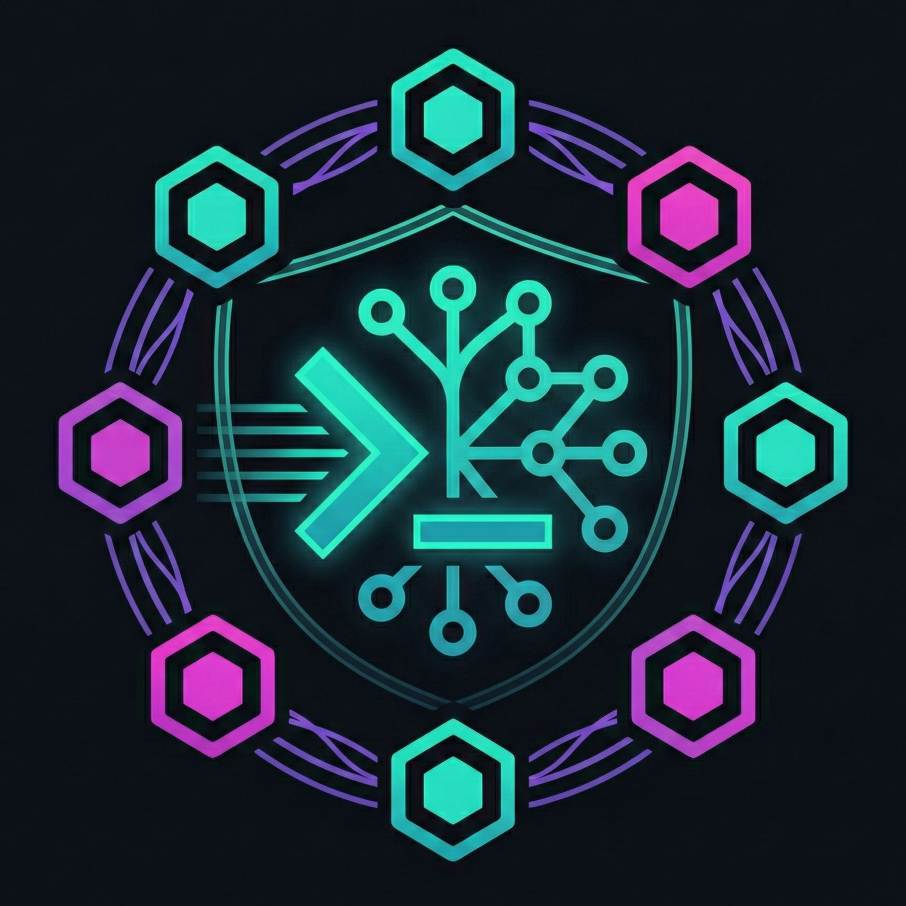

<p align="center">
  
</p>

<h1 align="center">Nex Code</h1>

<p align="center">
  Standalone agentic coding CLI with multi-provider support.<br>
  Streaming output, persistent conversations, colored diff previews, automatic project context.
</p>

<p align="center">
  Supports OpenAI, Anthropic, Google Gemini, Ollama Cloud, and local Ollama servers.
</p>

## Features

### Streaming Output
Tokens appear live as the model generates them. No waiting for the full response — you see the agent think in real time. Uses NDJSON streaming over the Ollama API with a braille spinner during connection.

### Conversation Mode
Context persists across messages. Ask follow-up questions, iterate on code, or have a multi-turn discussion — the agent remembers everything from the current session. Use `/clear` to start fresh.

### Diff Preview
Every file change is shown as a colored diff before being applied:
- **edit_file**: Red/green diff with 3 lines of context around changes
- **write_file** (existing file): Line-by-line comparison, up to 30 changed lines
- **write_file** (new file): Preview of the first 20 lines
- All changes require explicit `[y/n]` confirmation (toggle with `/autoconfirm`)

### Auto-Context
On startup, the CLI reads the project you're working in and injects context into the system prompt:
- `package.json` — name, version, scripts, dependency counts
- `README.md` — first 50 lines
- `git branch`, `git status`, `git log --oneline -5`
- `.gitignore` content

The agent knows your project before you type a single word.

### Safety Layer
Two tiers of protection:
- **Forbidden** (blocked, no override): `rm -rf /`, `mkfs`, `dd if=`, fork bombs, `curl|sh`, `cat .env`, `chmod 777`, `eval()`, reverse shells, code injection — 30+ patterns
- **Dangerous** (requires confirmation): `git push`, `npm publish`, `rm -rf`, `docker rm`, `kubectl delete`, `sudo`, `ssh`, `wget`, `pip install` — 14 patterns

## Setup

### Prerequisites
- Node.js 18+
- An [Ollama Cloud](https://ollama.com) API key (Pro plan, $20/month flat-rate)

### Installation

```bash
git clone git@github.com:hybridpicker/nex-code.git
cd nex-code
npm install
cp .env.example .env
# Add your API key to .env:
#   OLLAMA_API_KEY=your-key-here
npm link
```

After `npm link`, `nex-code` is globally available in your terminal.

### Verify

```bash
cd ~/any-project
nex-code
```

You should see the banner, your project context, and the `nex>` prompt.

## Usage

```
nex> explain the main function in index.js
nex> add input validation to the createUser handler
nex> run the tests and fix any failures
nex> refactor this to use async/await instead of callbacks
```

The agent decides autonomously whether to use tools or just respond with text. Simple questions get direct answers. Coding tasks trigger the agentic tool loop.

### Commands

Type `/` to see inline suggestions as you type — commands filter live with each keystroke. Tab completion is also supported.

| Command | Description |
|---------|-------------|
| `/help` | Show all commands |
| `/model <name>` | Switch model (`kimi-k2.5`, `qwen3-coder`) |
| `/model` | Show active model |
| `/clear` | Clear conversation history |
| `/context` | Show current project context |
| `/autoconfirm` | Toggle auto-confirm (skip `[y/n]` prompts) |
| `/exit` | Quit (also `/quit` or Ctrl+C) |

## Tools

The agent has 6 tools available:

| Tool | Description |
|------|-------------|
| `bash` | Execute shell commands (90s timeout, 5MB buffer) |
| `read_file` | Read files with optional line range |
| `write_file` | Create or overwrite files (with diff preview + confirmation) |
| `edit_file` | Targeted text replacement (with diff preview + confirmation) |
| `list_directory` | Tree view with depth control and glob filtering |
| `search_files` | Regex search across files (like grep, max 50 results) |

## Models

| Model | ID | Description |
|-------|-----|-------------|
| **Kimi K2.5** | `kimi-k2.5` | Default. Fast, capable coding model via Ollama Cloud |
| **Qwen3 Coder** | `qwen3-coder` | Alternative coding model |

Both run on Ollama Cloud (Pro plan). Switch at runtime with `/model <name>`.

## Skills

Extend Nex Code with project-specific knowledge, commands, and tools via `.nex/skills/`.

### Prompt Skills (`.md`)
Drop a Markdown file into `.nex/skills/` and its content is injected into the system prompt:

```
.nex/skills/code-style.md
```
```markdown
# Code Style
- Always use semicolons
- Prefer const over let
- Use TypeScript strict mode
```

### Script Skills (`.js`)
CommonJS modules that can provide instructions, slash commands, and tools:

```javascript
// .nex/skills/deploy.js
module.exports = {
  name: 'deploy',
  description: 'Deployment helper',
  instructions: 'When deploying, always run tests first...',
  commands: [
    { cmd: '/deploy', desc: 'Run deployment', handler: (args) => { /* ... */ } }
  ],
  tools: [
    {
      type: 'function',
      function: { name: 'deploy_status', description: 'Check deploy status', parameters: { type: 'object', properties: {} } },
      execute: async (args) => 'deployed'
    }
  ]
};
```

### Management

| Command | Description |
|---------|-------------|
| `/skills` | List all loaded skills |
| `/skills enable <name>` | Enable a skill |
| `/skills disable <name>` | Disable a skill |

Skills are loaded on startup from `.nex/skills/`. All skills are enabled by default. Disabled skills are tracked in `.nex/config.json`.

## Architecture

```
nex-code/
├── bin/
│   └── nex-code.js    # Shebang entrypoint — loads .env, starts REPL
└── cli/
    ├── index.js           # REPL loop, slash command handling
    ├── agent.js           # Agentic loop, conversation state (max 30 iterations)
    ├── ollama.js          # Ollama Cloud API client (streaming + fallback)
    ├── tools.js           # 6 tool definitions (Ollama format) + implementations
    ├── diff.js            # LCS-based diff algorithm, colored output, confirmations
    ├── context.js         # Auto-context: package.json, git, README, .gitignore
    ├── ui.js              # ANSI colors, braille spinner, formatting helpers
    └── safety.js          # Forbidden/dangerous pattern detection, confirm logic
```

8 focused modules instead of a single monolithic file. Each module has a single responsibility.

### Agentic Loop

```
User Input
    ↓
[System Prompt + Project Context + Conversation History]
    ↓
Ollama API (streaming) ──→ Text tokens → stdout (live)
    ↓                  └──→ Tool calls → execute
    ↓
[Tool Results added to history]
    ↓
Loop until: no more tool calls OR 30 iterations
```

### API Integration

- **Base URL**: `https://ollama.com/api/chat`
- **Auth**: `Authorization: Bearer $OLLAMA_API_KEY`
- **Streaming**: NDJSON (`stream: true`), parsed line-by-line
- **Temperature**: 0.2 (deterministic coding output)
- **Max tokens**: 16384 per response

## Testing

```bash
npm test              # Run all tests with coverage
npm run test:watch    # Watch mode for development
```

**8 test suites, 173 tests, 95% coverage:**

| Module | Statements | Lines |
|--------|-----------|-------|
| safety.js | 100% | 100% |
| context.js | 100% | 100% |
| diff.js | 97.8% | 97.5% |
| index.js | 97% | 97% |
| ollama.js | 96.4% | 100% |
| agent.js | 92.3% | 94% |
| tools.js | 91.6% | 93.8% |
| ui.js | 90.9% | 90.3% |

## Dependencies

Only 2 runtime dependencies:

```json
{
  "axios": "^1.7.0",
  "dotenv": "^16.4.0"
}
```

Everything else (readline, fs, path, child_process) is Node.js built-in.

## License

MIT
